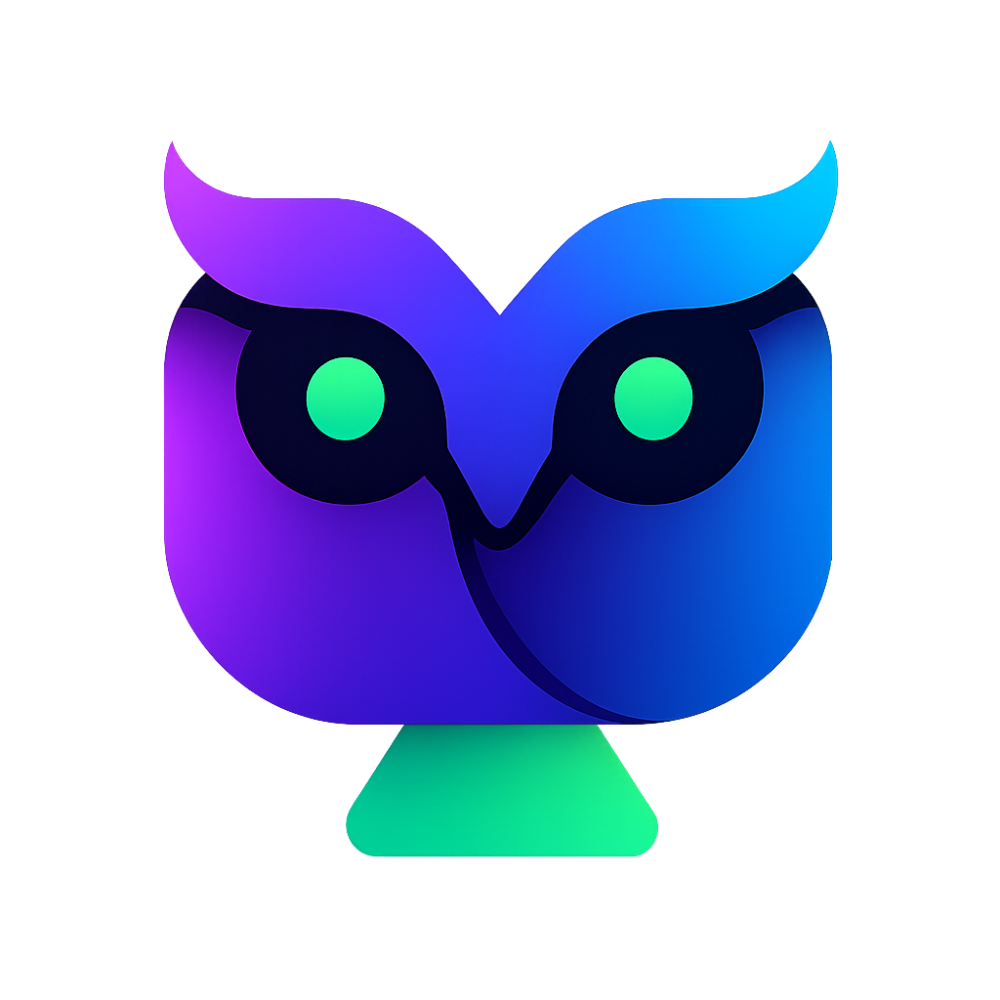
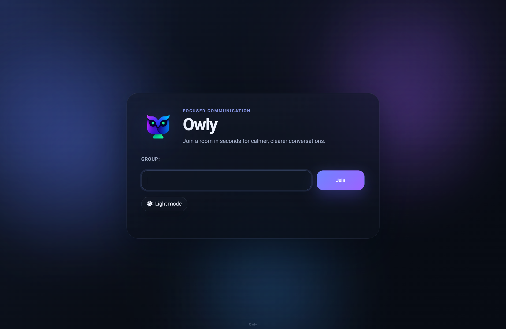
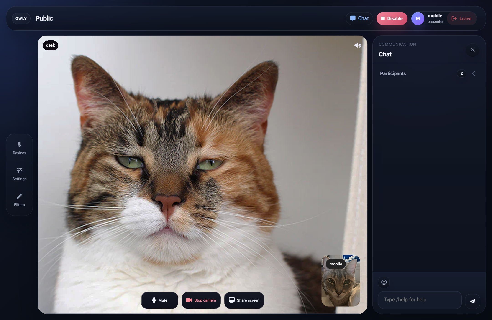

<p align="center">
  
</p>

<h1 align="center">Owly</h1>

<p align="center">
  <strong>Focused WebRTC communication for clear calls, quick room joins, and modern collaboration.</strong>
</p>

<p align="center">
  Shared screens, chat, reactions, mobile-first layouts, and a clean interface built for real conversations.
</p>

<p align="center">
  <a href="#preview"><strong>Preview</strong></a>
  &nbsp;&nbsp;&middot;&nbsp;&nbsp;
  <a href="#highlights"><strong>Highlights</strong></a>
  &nbsp;&nbsp;&middot;&nbsp;&nbsp;
  <a href="#quick-start"><strong>Quick Start</strong></a>
  &nbsp;&nbsp;&middot;&nbsp;&nbsp;
  <a href="#development"><strong>Development</strong></a>
</p>

## Preview





## Highlights

- WebRTC video rooms with participant-first layouts
- Shared screen focus and browser fullscreen support
- Mobile-first conference behavior with draggable selfie preview
- Per-user volume controls and participant presence indicators
- Built-in chat, reactions, and invite sharing
- Optional camera filters and background effects
- Go backend with static frontend, easy to build and deploy

## Quick Start

```sh
git clone <your-repository-url>
cd owly
CGO_ENABLED=0 go build -ldflags='-s -w'
mkdir groups
echo '{"users":{"owner":{"password":"secret","permissions":"op"}}}' > groups/public.json
./owly
```

Open:

```text
https://localhost:8443/group/public/
```

Then sign in with:

- username: `owner`
- password: `secret`

## What You Get

### Communication

- Direct video calls with adaptive conference layouts
- Shared screen focus mode
- Per-user audio controls
- Chat, emoji, and reactions

### Admin and Operations

- Group-based access control
- Invite links
- Built-in TURN support
- Automated frontend, backend, security, and smoke checks

### UX Details

- Compact mobile layout
- Draggable and collapsible selfie preview
- Focus mode for participant tiles
- Best-effort audio output switching where the browser supports it

## Development

### Core commands

```sh
npm run lint
npm run test
npm run test:security
npm run test:smoke
```

### Windows build

```powershell
.\build.cmd build
```

### Optional media assets

```powershell
.\build.cmd blur
```

## Helm

An example Helm chart is included in `charts/owly`.

Install it with:

```sh
helm upgrade --install owly ./charts/owly \
  --set image.repository=ghcr.io/yanadevops/owly \
  --set image.tag=latest
```

By default the chart:

- exposes Owly on port `8443`
- creates persistent volumes for `data` and `recordings`
- ships a sample `public` group through a ConfigMap

Override `values.yaml` to plug in your own image, ingress, storage class, and group configuration.

## Project Structure

- `static/` - frontend assets
- `charts/owly/` - example Helm chart for Kubernetes deployment
- `group/` - room and permission logic
- `rtpconn/` - WebRTC client and stream handling
- `webserver/` - HTTP and static delivery
- `turnserver/` - TURN integration
- `scripts/` - local validation helpers
- `test/` - frontend and browser smoke coverage

## Support

### Maintainer

[YanaDevOps](https://github.com/YanaDevOps)

### Sponsor

https://paypal.me/YanixLys666

### Donate

<p align="center">
  <a href="https://www.paypal.com/donate/?hosted_button_id=CGYZPN7LAH8BN">
    
  </a>
</p>

## License

MIT. See [LICENCE](LICENCE).
